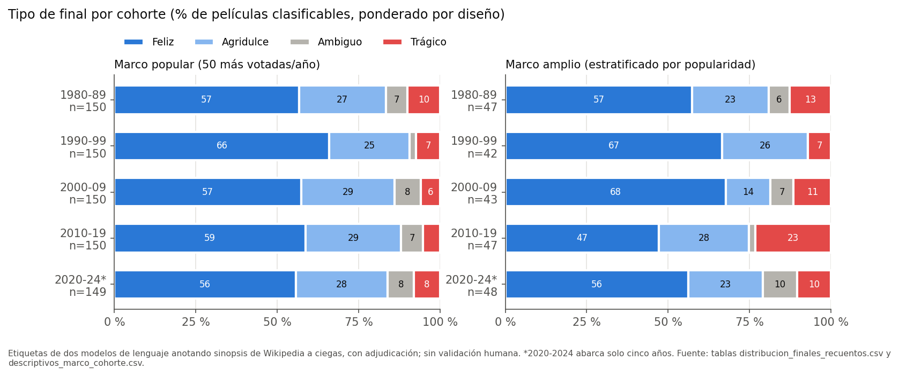
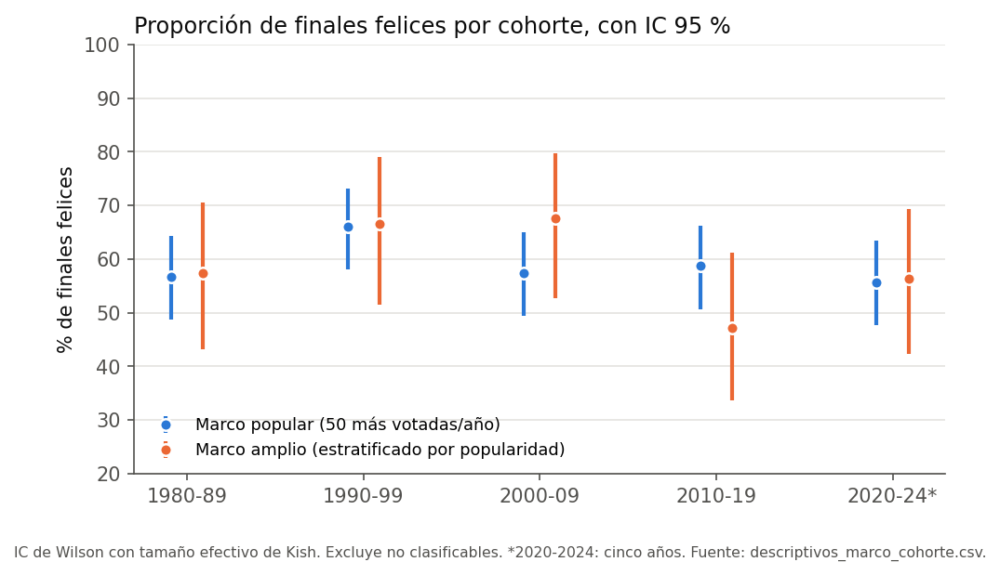
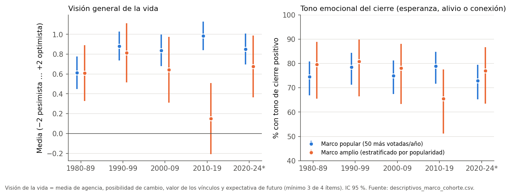
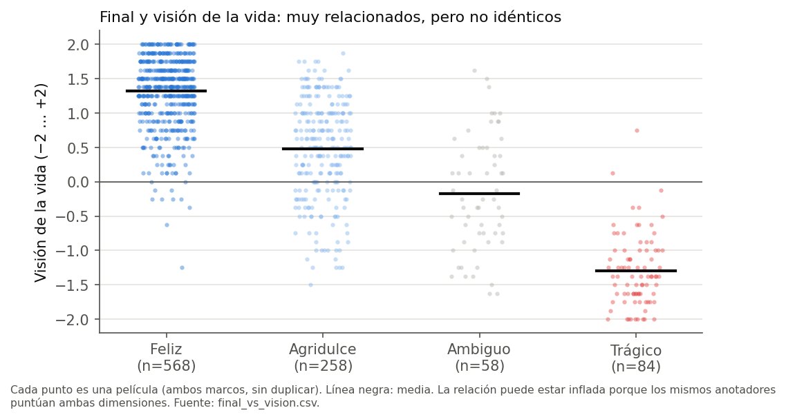
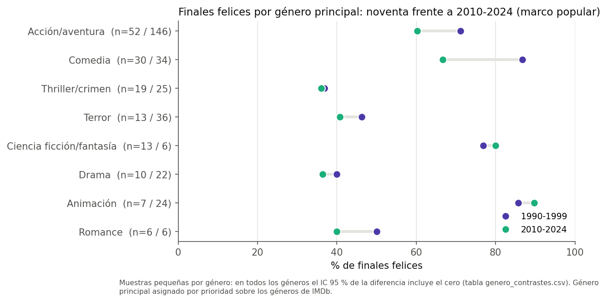
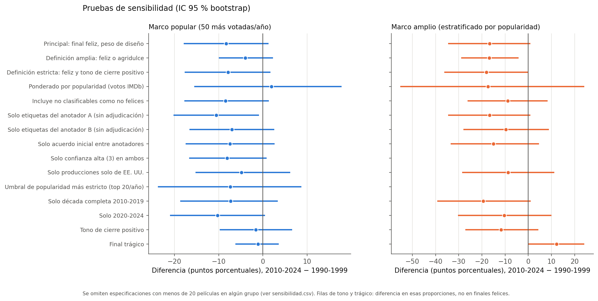

# ¿Eran más optimistas las películas de los noventa?

**Informe principal. Primera versión, exploratoria.** Generado automáticamente por `python -m finales.report` a partir de las tablas de `reports/tables/`. Cada cifra de este documento se lee de esas tablas (el volcado completo de valores está en `reports/tables/valores_informe.json`).

---

## 1. Pregunta y alcance

**Pregunta principal.** ¿En qué medida difieren las películas populares estadounidenses estrenadas entre 1990 y 1999 y las estrenadas desde 2010 en la frecuencia de finales felices, agridulces, ambiguos o trágicos y en el optimismo general que transmiten?

**Pregunta independiente.** ¿Prefiere el público actual más historias optimistas de las que percibe en el cine reciente? Esta segunda pregunta **no se ha contestado**: exige una encuesta o un experimento con personas, que se ha diseñado (sección 8 y `docs/diseno_encuesta.md`) pero no se ha realizado.

**Lo que este análisis no puede probar.** La idea de que «estaba prohibido hacer películas no optimistas» es una frase retórica. Con películas estrenadas solo se puede describir qué se estrenó, no qué se impidió estrenar. Probar una presión de la industria exigiría documentos de producción, versiones de guion, notas de estudio o testimonios, que quedan fuera de este proyecto.

**Población.** Largometrajes de ficción con país de origen EE. UU. (Wikidata), estrenados entre 1980 y 2024, en cinco cohortes: 1980-1989, 1990-1999, 2000-2009, 2010-2019 y 2020-2024. La última cohorte solo abarca **cinco años** y se analiza también por separado.

---

## 2. Límites que condicionan todas las conclusiones

Estos límites aparecen antes de los resultados a propósito: ninguna conclusión de este informe debe leerse sin ellos.

1. **Las etiquetas las han puesto modelos de lenguaje, no personas.** Dos modelos distintos anotaron cada sinopsis de forma independiente y a ciegas, y un tercer proceso adjudicó los desacuerdos. **No se ha hecho la validación humana**: el material para hacerla está preparado en `annotation/validacion_humana/` (100 películas estratificadas por cohorte). Un acuerdo alto entre dos modelos no garantiza que acierten: pueden compartir sesgos.
2. **El cegado apenas funcionó en el cine popular.** Se retiraron título y años, pero los anotadores dijeron reconocer la película en el 90 % (anotador A) y el 86 % (anotador B) de los casos. En el marco popular, **al menos uno reconoció el 100 % de las películas en todas las cohortes** y ambos, el 98 %. En el marco amplio, entre el 58 % y el 80 %, según la cohorte. Los anotadores pudieron usar lo que «saben» de la película o de su época. Por eso la sensibilidad que excluye las películas reconocidas no es evaluable en el marco popular: quedan 0 películas si se excluyen las reconocidas por alguno y 3/5 (90s/2010-2024) si se excluyen las reconocidas por ambos.
3. **Las sinopsis son de Wikipedia y están escritas hoy.** Es una ventaja (todas las décadas se describen con las mismas convenciones y en la misma época) y un riesgo (lo que los editores eligen contar puede variar según la película sea antigua o reciente, o más o menos conocida). El análisis mide los finales **tal como los resume Wikipedia**, no las películas.
4. **La popularidad se mide con votos actuales de IMDb.** Los votos son retrospectivos: las películas de los noventa que hoy tienen muchos votos son las que se siguen recordando, lo que introduce un sesgo de supervivencia que puede diferir por década. La taquilla de Wikidata es escasa y no está ajustada por inflación, así que no se usó.
5. **La muestra es pequeña para diferencias moderadas.** Con 150 películas por cohorte en el marco popular, la diferencia mínima detectable (potencia del 80 %) entre los noventa y 2010-2024 es de unos 13,8 pp. Para detectar 10 puntos harían falta unas 293 películas por cohorte. En el marco amplio (50 por cohorte) la diferencia mínima detectable es de 23,9 pp. **El análisis es exploratorio, no representativo en sentido estricto.**
6. **Marco amplio con umbral de visibilidad.** El marco amplio no es todo el cine estadounidense, sino las películas con al menos 1.000 votos en IMDb, artículo en Wikipedia y sección argumental de 120 palabras o más. En ese marco faltan más desenlaces en algunas cohortes (no clasificables: 8 en los noventa frente a 3 en 2010-2019), y eso influye en las comparaciones.
7. **Nacionalidad por Wikidata.** «Estadounidense» = EE. UU. figura entre los países de origen; se incluyen coproducciones (hay una prueba de sensibilidad solo con producciones exclusivamente estadounidenses). Las películas no estadounidenses y las de nacionalidad no establecida no se distinguen en las exclusiones.
8. **Condiciones de uso de IMDb.** Los datos de IMDb solo se permiten para uso personal y no comercial y no pueden republicarse como base de datos. Por eso los datos derivados publicados no incluyen votos ni puntuaciones de IMDb, solo identificadores y tramos de popularidad. Quien reproduzca el flujo debe descargarlos y aceptar esas condiciones.

---

## 3. Datos y procedencia

| Fuente | Uso | Licencia o condiciones | Consulta |
|---|---|---|---|
| IMDb Non-Commercial Datasets (`title.basics`, `title.ratings`) | Títulos, año, duración, géneros, votos | Uso personal y no comercial; atribución: *Information courtesy of IMDb (https://www.imdb.com). Used with permission.* | 2026-09-29 |
| Wikidata (consulta SPARQL por año) | País de origen, enlace a Wikipedia, fecha de publicación | CC0 | 2026-09-29 |
| Volcado de Wikipedia en inglés, 1 de septiembre de 2026 (`enwiki-20260901-pages-articles-multistream`) | Sección argumental (*Plot*) de cada película muestreada | CC BY-SA 4.0 | 2026-09-29, índice verificado con el SHA-1 publicado |
| CMU Movie Summary Corpus (Bamman, O'Connor y Smith, 2013) | Solo para evaluar su cobertura | CC BY-SA | 2026-09-29 |

Cada descarga está registrada en `data/provenance.jsonl` (URL, fecha, licencia y hash). Cada película de la muestra guarda la URL de la revisión exacta de Wikipedia usada (`data/derived/muestra_principal.csv`). El texto de las sinopsis no se redistribuye en los datos derivados (minimización), aunque su licencia lo permitiría con atribución.

**Por qué no se usó el CMU Movie Summary Corpus como fuente principal.** Se construyó con un volcado de Wikipedia de 2012 y su cobertura de películas recientes es insuficiente: tiene sinopsis para el 83 % del catálogo de los noventa, pero solo para el 17 % del de 2010-2019 y el 0 % del de 2020-2024 (`reports/tables/cobertura_cmu.csv`). Mezclar fuentes por década habría confundido el cambio en las películas con el cambio de fuente.

**Por qué el volcado y no la API.** La API REST de Wikipedia devolvía de forma sistemática HTTP 429 (demasiadas peticiones) desde la IP compartida del entorno. El volcado público permite leer por rangos HTTP solo los bloques con los artículos necesarios, con una versión fechada y verificable.

---

## 4. Método

### 4.1 Catálogo

A partir de IMDb: `titleType = movie`, año 1980-2024, duración de 60 minutos o más, sin géneros de no ficción (*Documentary*, *Reality-TV*, *Talk-Show*, *News*, *Game-Show*, *Adult*), al menos 1.000 votos, país de origen EE. UU. en Wikidata, artículo en la Wikipedia en inglés y año coherente entre IMDb y Wikidata (desfase de un año como máximo). Los duplicados de artículo se resuelven conservando el título con más votos. Cada exclusión recibe un único motivo, el primer filtro que falla (`reports/tables/exclusiones_resumen.csv`). Por ejemplo, 179.382 títulos del periodo quedaron fuera por no llegar a 1.000 votos y 21.579 por no constar como estadounidenses en Wikidata.

Catálogo elegible: **13.950 películas** (1980-89: 1.817; 1990-99: 2.368; 2000-09: 3.332; 2010-19: 4.503; 2020-24: 1.930).

### 4.2 Marcos de muestra

* **Popular**: las 50 películas con más votos de cada año. Por cohorte se extraen 150 películas, repartidas por género principal en proporción a su peso en ese universo.
* **Amplio**: todo el catálogo elegible. Por cohorte se extraen 50 películas, a partes iguales entre los tres terciles de votos de cada año y, dentro de cada tercil, en proporción al género. Cada película lleva su peso de diseño (tamaño del estrato / muestra del estrato).

El orden aleatorio es estable (hash de semilla y título) y no depende del orden de las filas. Las películas sin sinopsis utilizable se sustituyen por la siguiente del mismo estrato y quedan registradas: 47 sustituciones en total (4 en el marco popular y 43 en el amplio; `reports/tables/muestreo_log_principal.csv`). Las del piloto no entran en la muestra principal. Resultado: 1000 filas y **994 películas distintas** (6 están en ambos marcos). La mediana de longitud de las sinopsis es de 627 palabras.

El **género principal** se asigna con una prioridad fija sobre los hasta tres géneros de IMDb: Animación > Terror > Acción/aventura > Ciencia ficción/fantasía > Comedia > Romance > Thriller/crimen > Drama > Otros.

### 4.3 Anotación

El **manual** (`docs/manual_anotacion.md`) define cinco dimensiones que se miden por separado:

1. **Final**: feliz, agridulce, ambiguo, trágico o no clasificable.
2. **Resultado para los protagonistas**: supervivencia, objetivo, vínculos y justicia narrativa.
3. **Tono del cierre**: esperanza, alivio, conexión, resignación o desesperanza (y su valencia).
4. **Visión de la vida**: agencia, posibilidad de cambio, valor de los vínculos y expectativa de futuro, de −2 a +2.
5. **Arco emocional**: **no se ha medido**. Requiere guiones o subtítulos con procedencia y permisos verificables, y no se encontró ningún corpus así.

**Piloto.** Con 50 películas de todas las cohortes, dos anotadores independientes obtuvieron un kappa de Cohen de 0,87 para el final y de 0,48 para el tono del cierre. El manual se ajustó solo con el piloto (reglas marcadas [v1.0]: poscréditos, finales alternativos, dos protagonistas, historias sin conflicto central, procedimiento de decisión del tono) y se congeló como versión 1.0 antes de la muestra principal; su hash está en `docs/manual_anotacion_v1.0.sha256`. Ninguna definición de las categorías de final cambió.

**Tamaño.** En el piloto, la proporción de finales felices fue del 58 % y la desviación típica de la visión de la vida, de 1,18. Con esos valores, detectar 10 puntos de diferencia exigiría 293 películas por cohorte y detectar 15, 130 (`reports/tables/potencia_piloto.csv`). Por capacidad de anotación se fijaron 150 por cohorte en el marco popular y 50 en el amplio.

**Anotadores.** Cada sinopsis cegada (sin título ni años) la anotaron **dos modelos de lenguaje distintos, de forma independiente** (A y B), en lotes de 50 con el orden de cohortes mezclado. Los desacuerdos de cualquier campo, y las diferencias de 3 o más puntos en los ítems, los resolvió un **adjudicador** que veía las dos etiquetas en orden aleatorio sin saber de quién era cada una. Se adjudicaron 522 películas, 96 de ellas por desacuerdo en el final. El adjudicador comparte familia de modelo con el anotador A y le dio la razón en el 74 % de los desacuerdos sobre el final. Por eso hay pruebas de sensibilidad con las etiquetas de A solas y de B solas.

**Corrección durante la anotación.** A mitad de la anotación se detectó que en algunos artículos la extracción de la sección argumental arrastraba texto de producción o de recepción. Se corrigió el extractor (con pruebas), se volvieron a anotar las 6 películas ya anotadas afectadas y se apartaron sus etiquetas obsoletas (`reports/tables/reanotacion_correccion_sinopsis.csv`, registro D-017).

### 4.4 Análisis

* Proporciones con intervalo de Wilson y tamaño efectivo de Kish (ponderación de diseño); medias con IC t.
* Diferencias frente a los noventa en puntos porcentuales y como razón, con IC bootstrap estratificado (4.000 réplicas).
* Efecto ajustado de 2010-2024 frente a 1990-1999: logit ponderado con género principal y popularidad como controles y efecto marginal medio por g-computación (bootstrap de 500 réplicas); MCO con errores HC3 para la visión de la vida. La popularidad se controla con el logaritmo del rango de votos en el año (marco popular) o con el tercil (marco amplio). El percentil de votos se descartó porque depende del tamaño del catálogo anual, que crece con los años (registro D-019).
* Los no clasificables se excluyen de las proporciones de final y se incluyen en una prueba de sensibilidad.

---

## 5. Resultados

### 5.1 Tipos de final por cohorte

**Marco popular (150 películas por cohorte), % de finales felices con IC 95 %:**

| Cohorte | Feliz | Agridulce | Ambiguo | Trágico |
|---|---|---|---|---|
| 1980-1989 | 56,7 % [48,7 %; 64,3 %] | 26,7 % | 6,7 % | 10,0 % |
| 1990-1999 | 66,0 % [58,1 %; 73,1 %] | 24,7 % | 2,0 % | 7,3 % |
| 2000-2009 | 57,3 % [49,3 %; 65,0 %] | 28,7 % | 8,0 % | 6,0 % |
| 2010-2019 | 58,7 % [50,7 %; 66,2 %] | 29,3 % | 6,7 % | 5,3 % |
| 2020-2024* | 55,7 % [47,7 %; 63,4 %] | 28,2 % | 8,1 % | 8,1 % |

**Marco amplio (50 películas por cohorte, ponderado por diseño):**

| Cohorte | Feliz | Agridulce | Ambiguo | Trágico |
|---|---|---|---|---|
| 1980-1989 | 57,4 % [43,2 %; 70,5 %] | 23,4 % | 6,4 % | 12,8 % |
| 1990-1999 | 66,6 % [51,5 %; 78,9 %] | 26,3 % | 0,0 % | 7,1 % |
| 2000-2009 | 67,6 % [52,7 %; 79,7 %] | 13,8 % | 7,1 % | 11,5 % |
| 2010-2019 | 47,1 % [33,6 %; 61,1 %] | 27,6 % | 2,1 % | 23,2 % |
| 2020-2024* | 56,3 % [42,3 %; 69,3 %] | 22,8 % | 10,5 % | 10,5 % |

\* Cohorte de cinco años. Los recuentos (incluidos los no clasificables: 1 en el marco popular y 23 en el amplio) están en `reports/tables/distribucion_finales_recuentos.csv`.

### 5.2 Comparación de los noventa con 2010-2024

**Marco popular.** La proporción de finales felices pasa del 66,0 % en los noventa al 57,7 % [51,7 %; 63,4 %] en 2010-2024: **−8,3 pp [−17,7 pp; +1,2 pp]**, una razón de 0,87 [0,75; 1,02]. El intervalo incluye el cero. Por cohorte: 2010-2019 −7,3 pp [−18,7 pp; +3,3 pp] y 2020-2024 −10,3 pp [−21,0 pp; +0,4 pp].

Los noventa también tienen la proporción más alta frente a las demás cohortes: la diferencia de los ochenta respecto a los noventa es de −9,3 pp [−20,0 pp; +2,0 pp] y la de los dos mil, de −8,7 pp. Estos intervalos también incluyen el cero. El patrón **sugiere** que los noventa fueron un pico más que el final de una época feliz que se rompe en 2010, pero no lo demuestra.

En los demás tipos de final (2010-2024 frente a los noventa):

* Agridulces: +4,3 pp [−4,4 pp; +13,0 pp].
* Ambiguos: +5,1 pp [+1,3 pp; +8,9 pp]. Contrastes del marco popular (2010-2024 frente a los noventa) cuyo intervalo excluye el cero: ambiguos. Este parte de una base muy baja en los noventa (2,0 %).
* Trágicos: −1,1 pp [−6,2 pp; +3,8 pp]. Sin indicios de más finales trágicos en el cine popular reciente.

**Efecto ajustado** por género y popularidad: −7,7 pp [−18,0 pp; +2,3 pp] en finales felices.

**Marco amplio.** La caída aparente es mayor pero mucho más incierta: finales felices −16,7 pp [−33,8 pp; +0,9 pp] (ajustado: −11,5 pp [−26,9 pp; +4,0 pp]) y trágicos +12,2 pp [+0,4 pp; +23,5 pp], un intervalo que roza el cero. La diferencia procede sobre todo de 2010-2019 (trágicos +16,0 pp [+2,4 pp; +29,9 pp]); en 2020-2024 es de +3,3 pp [−7,9 pp; +14,6 pp]. Con 50 películas por cohorte y más no clasificables en los noventa, el resultado es frágil y la sensibilidad apunta en ambos sentidos. Si los no clasificables se cuentan como no felices, la diferencia baja a −8,9 pp [−25,2 pp; +7,5 pp]. En cambio, con otras definiciones de final feliz el intervalo excluye el cero: «Definición amplia: feliz o agridulce»; «Definición estricta: feliz y tono de cierre positivo». Contrastes del marco amplio cuyo intervalo excluye el cero: ambiguos, trágicos, visión de la vida.

### 5.3 Tono del cierre, visión de la vida y protagonistas

* **Tono del cierre positivo** (esperanza, alivio o conexión), marco popular: 78,5 % en los noventa; diferencia en 2010-2024: −1,6 pp [−9,9 pp; +6,5 pp]. Marco amplio: −11,7 pp [−26,6 pp; +4,4 pp].
* **Visión de la vida** (−2 a +2), marco popular: 0,88 [0,74; 1,03] en los noventa; diferencia de +0,06 [−0,12; +0,24] en 2010-2024 (ajustada: +0,03). Ochenta: 0,61 [0,45; 0,78]. **En el cine popular no se observa una visión de la vida menos optimista desde 2010**; el intervalo descarta caídas de más de 0,12 puntos.
* Marco amplio: visión de la vida −0,51 [−0,88; −0,13] (ajustada: −0,42 [−0,77; −0,08]), concentrada en 2010-2019 (−0,66 [−1,09; −0,23]). Es la señal más clara de menor optimismo, pero procede de la muestra pequeña y está sujeta a las reservas del apartado anterior.
* **Protagonistas**, marco popular (noventa frente a 2010-2019): el protagonista sobrevive en el 81,9 % frente al 83,8 %, logra su objetivo en el 79,0 % frente al 75,5 % y hay justicia narrativa en el 66,4 % frente al 62,7 %. Son valores similares; los IC están en `descriptivos_marco_cohorte.csv`.

**Las dimensiones no son lo mismo.** La visión de la vida media (descriptiva, sin ponderar, ambos marcos juntos) es de 1,32 en los finales felices, 0,48 en los agridulces, −0,18 en los ambiguos y −1,30 en los trágicos. Están muy relacionadas, pero dentro de cada tipo de final hay mucha dispersión (figura 6). Parte de esa relación puede deberse a que los mismos anotadores puntúan ambas dimensiones.

### 5.4 Diferencias por género (marco popular)

| Género | n (90s/2010-24) | Feliz 90s | Feliz 2010-24 | Diferencia [IC 95 %] |
|---|---|---|---|---|
| Acción/aventura | 52/146 | 71 % | 60 % | −11,0 pp [−25,0 pp; +3,8 pp] |
| Comedia | 30/34 | 87 % | 67 % | −20,0 pp [−41,0 pp; +0,4 pp] |
| Terror | 13/36 | 46 % | 41 % | −5,3 pp [−36,6 pp; +25,9 pp] |
| Thriller/crimen | 19/25 | 37 % | 36 % | −0,7 pp [−30,4 pp; +28,9 pp] |

En ningún género el intervalo excluye el cero. La mayor caída puntual es la de comedia (−20,0 pp). La composición por géneros también cambió: en el marco popular, la acción/aventura pasa del 35 % al 49 %, la animación del 5 % al 8 % y la comedia del 20 % al 11 % (`composicion_generos.csv`; tabla por género en `genero_contrastes.csv`).

### 5.5 Pruebas de sensibilidad (marco popular, finales felices, 2010-2024 − 1990-1999)

| Especificación | Diferencia [IC 95 %] |
|---|---|
| Principal | −8,3 pp [−17,7 pp; +1,2 pp] |
| Feliz o agridulce | −4,0 pp [−10,1 pp; +2,2 pp] |
| Feliz con tono positivo | −7,9 pp [−17,2 pp; +1,7 pp] |
| Ponderado por votos de IMDb | +1,9 pp [−15,8 pp; +17,7 pp] |
| No clasificables como no felices | −8,4 pp [−18,2 pp; +1,3 pp] |
| Solo etiquetas de A | −10,5 pp [−19,9 pp; −1,0 pp] |
| Solo etiquetas de B | −7,0 pp [−16,6 pp; +2,5 pp] |
| Solo acuerdo inicial | −7,5 pp [−17,2 pp; +2,4 pp] |
| Solo confianza alta | −8,1 pp [−16,9 pp; +0,8 pp] |
| Solo producciones exclusivamente estadounidenses | −4,9 pp [−15,8 pp; +5,9 pp] |
| Umbral más estricto (20 más votadas/año) | −7,4 pp [−23,6 pp; +8,9 pp] |

De las 10 especificaciones alternativas de la tabla (sin contar la principal), 9 mantienen la dirección (menos finales felices después de los noventa). Sin la ponderación por votos, el tamaño varía entre 4,0 pp y 10,5 pp, y solo en 1 el intervalo excluye el cero: «Solo etiquetas del anotador A (sin adjudicación)». **Al ponderar por votos, el resultado se vuelve indeterminado** (+1,9 pp [−15,8 pp; +17,7 pp]; el tamaño efectivo de los noventa baja a unas 45 películas). Las películas de los noventa más votadas hoy tienen, en proporción, menos finales felices (51,0 %) que el conjunto de las 50 más votadas de cada año. Además, ponderar por votos actuales acentúa el sesgo de supervivencia. La variante «solo confianza alta» selecciona los casos más claros y cambia la base (los noventa pasan al 92,4 %), así que se interpreta con cautela. Un resultado tan dependiente de la especificación no permite hablar de un cambio robusto.

### 5.6 Calidad de la medición

* Acuerdo entre A y B en el final: 90 %, kappa de Cohen 0,84 (kappa ponderada ordinal: 0,90); final feliz sí/no: kappa 0,88.
* Tono del cierre: kappa 0,73; supervivencia 0,83; objetivo 0,75; vínculos 0,77; justicia narrativa 0,76.
* Visión de la vida: alfa de Krippendorff (intervalo) 0,95 para la puntuación media y entre 0,88 y 0,91 por ítem.
* El desacuerdo sobre «final feliz» va del 3,0 % al 8,1 % según la cohorte (`desacuerdo_por_grupo_principal.csv`). Por género, el desacuerdo sobre el final es mayor en drama (19 %) y thriller/crimen (16 %).

---

## 6. Revisión del análisis de Stephen Follows (2026)

Follows (*Has Hollywood given up on the happy ending?*) examinó 7.384 películas y clasificó los finales de 6.509 sinopsis. Según su artículo, clasificó las sinopsis con un modelo de lenguaje y una rúbrica fija, validada contra etiquetas humanas de bases de datos públicas, y lo contrastó con el análisis de expresiones faciales en 1,57 millones de primeros planos, la tonalidad musical y CinemaScore. Informa de que en torno a tres cuartas partes de las películas de acción de los ochenta y noventa terminaban felizmente, frente al 56 % desde 2010, de que aumentan los finales agridulces y de que los tristes no son más frecuentes que en los ochenta. Él mismo advierte que se trata de correlaciones.

**Lo que no se puede comprobar.** El artículo no publica los datos, no detalla cómo se seleccionaron las películas ni qué países incluye (menciona películas estadounidenses, francesas e indias) y no nombra la fuente de las sinopsis. Por eso no es replicable exactamente y sus cifras no se usan aquí como resultado.

**Comparación orientativa.** Con nuestra definición de acción (género principal Acción/aventura, marco popular), los finales felices pasan del 73,7 % [64,0 %; 81,5 %] en 1980-1999 (n=95) al 60,2 % [51,6 %; 68,1 %] en 2010-2024 (n=146): −13,5 pp [−25,2 pp; −1,3 pp]. La dirección y el orden de magnitud coinciden con los de Follows, aunque los clasificadores, las fuentes y las poblaciones son distintos. Dos matices: agrupar los ochenta con los noventa, como hace Follows, favorece el contraste, porque la acción de los ochenta tuvo más finales felices (76,7 %) que la de los noventa (71,2 %). Y para el conjunto de géneros la diferencia es menor e incierta; la mayor caída puntual por género es la de comedia, no la de la acción.

---

## 7. ¿Qué dicen los datos sobre la afirmación?

**La afirmación:** «el cine popular de los noventa era más optimista sobre la vida que el actual y el público echa de menos ese optimismo».

### Lo que los datos sostienen

Siempre con las etiquetas de modelos y las limitaciones de la sección 2:

* **En el cine popular no se observa un cambio grande hacia lo sombrío desde los noventa.** Los intervalos descartan una caída de los finales felices mayor de 17,7 pp, un aumento de los trágicos mayor de 3,8 pp, una caída del tono de cierre positivo mayor de 9,9 pp y una caída de la visión de la vida mayor de 0,12 puntos (escala de −2 a +2). No haber encontrado diferencias no demuestra que no existan: diferencias moderadas siguen siendo compatibles con los datos.
* Los finales **ambiguos** son algo más frecuentes que en los noventa (+5,1 pp [+1,3 pp; +8,9 pp]), pero los noventa son la excepción: los ochenta y los dos mil tienen niveles parecidos a los actuales.

### Lo que los datos sugieren, sin confirmarlo

* La proporción de finales felices en el cine popular fue **algo mayor en los noventa (66,0 %) que en 2010-2024 (57,7 %)**: −8,3 pp, IC [−17,7 pp; +1,2 pp], ajustado −7,7 pp [−18,0 pp; +2,3 pp]. El intervalo incluye el cero.
* Los noventa parecen un **pico** de finales felices dentro de 1980-2024, más que el final de una edad dorada. Los ochenta tienen una proporción parecida a la actual.
* En el cine de acción la caída es mayor (−13,5 pp) y coincide con lo que describe Follows, aunque la comedia cae incluso más (−20,0 pp).
* En el marco amplio (cine menos visible) hay indicios de menos finales felices y una visión de la vida más sombría en 2010-2019, pero con una muestra pequeña y problemas de cobertura.

### Lo que los datos no permiten afirmar

* Que el cine de los noventa fuera **claramente** más optimista: la diferencia se vuelve indeterminada al ponderar por popularidad y solo excluye el cero con las etiquetas de uno de los dos anotadores.
* Que hubiera una **prohibición** o presión de la industria para no hacer películas pesimistas: los datos de estrenos no pueden mostrarlo.
* Que el público **eche de menos** ese optimismo: no se ha hecho ninguna encuesta ni experimento. Las taquillas, los votos o los comentarios en redes no permiten inferir nostalgia.
* Nada sobre **causas**: se trata de asociaciones temporales.
* Nada definitivo mientras las etiquetas no se validen con personas.

---

## 8. Fase pendiente: ¿el público lo echa de menos?

La fase de encuesta o experimento está diseñada en `docs/diseno_encuesta.md` y no se ha ejecutado. En resumen:

* Pares de cierres comparables (mismo género, tono equilibrado), presentados como textos breves escritos para el estudio, **sin título ni año**.
* Se miden el optimismo percibido, las ganas de ver más películas de ese tipo, la preferencia entre cierres, la familiaridad previa y la nostalgia declarada.
* Con 8 pares por persona, detectar una preferencia de 5 puntos sobre el 50 % exige unos 167 participantes, y comparar a quienes crecieron con el cine de los noventa con los menores de 30 (10 puntos), unos 160.

Hasta que se haga, **la parte «se echa de menos» de la afirmación queda sin probar**.

---

---

## 9. Segunda parte (v2): censo del cine popular, cine español y ánimo de los personajes

La primera parte usaba una muestra aleatoria (150 películas populares por cohorte), y películas muy conocidas como *Titanic* no salieron en el sorteo. En esta segunda parte se anota el **universo completo** del marco popular estadounidense y se añade el cine español. Además, se miden características de los protagonistas y de la trama, y dos dimensiones de ánimo distintas del final: el **tono general** de la película y el **optimismo de los personajes**.

### 9.1 Límites específicos de la segunda parte

* **Sigue sin haber validación humana.** Todas las etiquetas son de dos modelos de lenguaje y un adjudicador.
* **El cegado no funciona en el cine popular.** Al menos un modelo dijo reconocer el 98,5 % de las películas estadounidenses (y el 28 % de las españolas). La sensibilidad que excluye las películas reconocidas no puede calcularse en EE. UU.
* **Adjudicación parcial (D-026).** Solo se adjudicaron `final` y los ítems de −2 a 2 con diferencia ≥3. En las demás categóricas en desacuerdo manda el anotador A, así que las covariables del módulo B tienen más error de medición que el núcleo v1.
* **El cine español se lee peor.** La Wikipedia en español a menudo no cuenta el desenlace. Tras volver a anotar 65 películas con la sinopsis inglesa (D-027), el 58 % de las españolas sigue sin final clasificable (antes, el 61 %). Ese porcentaje varía por cohorte (del 48 % en 2010-2019 al 65 % en los noventa), así que las comparaciones españolas se hacen sobre las clasificables, con riesgo de selección. Hay además un umbral de votos distinto del estadounidense (50 frente a 1.000) y sinopsis en varios idiomas o de TMDB (D-035).
* **Un censo de lo que hoy se vota.** «Las 50 más votadas de cada año» se mide con votos actuales, con sesgo de supervivencia. Los intervalos miden la variabilidad del proceso que genera las películas (superpoblación), no un error de muestreo (D-029).
* **Tono y optimismo son juicios más subjetivos** que el tipo de final, aunque el acuerdo fue alto (α 0,92 y 0,83). Además, el optimismo de los personajes se infiere de un resumen, no de la película.
* **Muchas comparaciones por subgrupo.** De 34 contrastes de finales felices por subgrupo, 9 excluyen el cero. Con tantas pruebas, alguno lo hará por azar. Se presentan como exploratorios.
* **IMDb solo en agregado.** La relación con la nota de IMDb es asociativa: mide la opinión de quien vota en IMDb, no la del público general, y no dice nada de la nostalgia.

### 9.2 Datos y método

* **Universo estadounidense:** las 50 películas estadounidenses con más votos de cada año, 1980-2025, con sinopsis utilizable: **2.343 películas**.
* **Universo español:** las 30 películas españolas (sin coproducciones mayoritariamente extranjeras) más votadas de cada año con al menos 50 votos: **1.340 películas** (D-023, D-033 a D-035). Hay 2 coproducciones que están en ambos universos y cuentan en los dos.
* **Anotación completa** (núcleo del manual 1.0 más módulo B del manual 2.0) de 1.892 películas con doble anotación ciega. Las 777 películas del universo que ya estaban en la primera parte conservan sus etiquetas del núcleo, adjudicadas por completo, y recibieron solo el módulo B, con el mismo texto cegado.
* **Módulo B:** género, edad, momento vital, estado civil y clase social del protagonista; relaciones centrales (hasta 3); si la historia es especulativa (ciencia ficción, fantasía, sobrenatural, superhéroes); época y países de la trama; humor; tono general (−2 a +2); optimismo de los personajes (−2 a +2).
* **Acuerdo A-B** (películas nuevas): final κ = 0,86; tono de cierre κ = 0,74; momento vital κ = 0,76; clase social κ = 0,78; estado civil κ = 0,81; especulativa κ = 0,93; época κ = 0,84; humor κ = 0,81; tono general α = 0,92; optimismo de los personajes α = 0,83; relaciones (Jaccard) 0,76; países (Jaccard) 0,92. En las películas de la primera parte, las κ del módulo B van de 0,78 a 0,94. Tablas: `reports/tables/acuerdo_v2_completa.csv` y `acuerdo_v2_modb.csv`.
* **Adjudicación:** 244 finales adjudicados por un tercer modelo que no sabía qué anotador había dicho qué.
* **Análisis** (`src/finales/analysis_v2.py`): proporciones con intervalo de Wilson y medias con IC t; contrastes entre 2010-2025 y los noventa con bootstrap por película (2.000 réplicas); modelos ajustados en EE. UU. (logit con efecto marginal medio por g-computación para final feliz; MCO con errores HC3 para el optimismo), controlando género, log del rango de votos en el año y, en una segunda especificación, especulativa, época contemporánea, clase social, momento vital, género del protagonista y humor. Relación con IMDb: MCO de la nota media y del log de los votos sobre final feliz, optimismo o tono, con efectos fijos de año y género.

### 9.3 Resultados

**Tipos de final y ánimo por cohorte** (finales sobre películas clasificables):

| País | Cohorte | n | No clasif. | Feliz [IC 95 %] | Agridulce | Ambiguo | Trágico | Optimismo personajes | Tono general | Personajes optimistas en finales no felices |
|---|---|---|---|---|---|---|---|---|---|---|
| EE. UU. | 1980-1989 | 498 | 0 % | 61,9 % [57,5 %; 66,0 %] | 22,3 % | 5,8 % | 10,0 % | +0,38 | −0,14 | 27 % |
| EE. UU. | 1990-1999 | 499 | 0 % | 67,3 % [63,0 %; 71,2 %] | 23,1 % | 2,2 % | 7,4 % | +0,45 | −0,05 | 35 % |
| EE. UU. | 2000-2009 | 499 | 0 % | 60,9 % [56,6 %; 65,1 %] | 26,9 % | 4,2 % | 8,0 % | +0,42 | −0,13 | 30 % |
| EE. UU. | 2010-2019 | 500 | 0 % | 63,2 % [58,9 %; 67,3 %] | 26,8 % | 4,4 % | 5,6 % | +0,53 | −0,18 | 40 % |
| EE. UU. | 2020-2025 | 299 | 0 % | 58,1 % [52,4 %; 63,5 %] | 25,2 % | 8,4 % | 8,4 % | +0,30 | −0,44 | 26 % |
| España | 1980-1989 | 275 | 64 % | 31,3 % [23,0 %; 41,0 %] | 22,2 % | 13,1 % | 33,3 % | +0,03 | −0,31 | 12 % |
| España | 1990-1999 | 255 | 65 % | 26,1 % [18,1 %; 36,2 %] | 36,4 % | 6,8 % | 30,7 % | +0,06 | −0,30 | 35 % |
| España | 2000-2009 | 300 | 55 % | 31,3 % [24,1 %; 39,6 %] | 34,3 % | 6,0 % | 28,4 % | +0,16 | −0,33 | 30 % |
| España | 2010-2019 | 300 | 48 % | 37,8 % [30,6 %; 45,6 %] | 32,7 % | 8,3 % | 21,1 % | +0,07 | −0,41 | 21 % |
| España | 2020-2025 | 180 | 58 % | 45,3 % [34,6 %; 56,5 %] | 30,7 % | 8,0 % | 16,0 % | +0,24 | −0,27 | 34 % |

**EE. UU.: el censo confirma una caída pequeña de los finales felices, concentrada en 2020-2025.** En los noventa acababa bien el 67,3 % [63,0 %; 71,2 %] de las películas populares; en 2010-2025, el 61,3 %. La diferencia es de −6,0 pp [−11,3 pp; −0,7 pp]. Por cohortes: 2010-2019 −4,1 pp [−9,9 pp; +1,7 pp] y 2020-2025 −9,2 pp [−16,2 pp; −2,2 pp]. Los ochenta (61,9 %) y los dos mil (60,9 %) también quedan por debajo de los noventa, que vuelven a parecer un pico. Ajustado por género y popularidad, la diferencia es de −7,4 pp en 2010-2019 y −9,0 pp en 2020-2025. Si se ajusta también por protagonista y trama, queda en −3,9 pp y −7,2 pp: parte de la caída se explica por el tipo de historias. Los finales trágicos no aumentan (−0,8 pp [−3,8 pp; +2,1 pp]).

**El optimismo de los personajes no ha bajado, salvo en 2020-2025.** La media del cine popular estadounidense va de +0,38 en los ochenta a +0,45 en los noventa y +0,53 en 2010-2019. En 2020-2025 cae a +0,30 (−0,15 [−0,28; −0,01] frente a los noventa). El **tono general** sí se oscurece algo: −0,23 [−0,35; −0,10] entre los noventa y 2010-2025.

**Final y ánimo son cosas distintas.** Entre los finales felices, el 77 % tiene personajes optimistas; entre los agridulces, el 40 %; entre los ambiguos, el 25 %; y entre los trágicos, 1 de cada 11 (9 %). *Titanic* se clasifica como final agridulce, con optimismo de los personajes +2: es el caso típico de desenlace con pérdida y personajes vitalistas. Las «tragedias vitalistas» en sentido estricto (final trágico y personajes optimistas) son raras: el 1,2 % de las películas. La proporción de finales no felices con personajes optimistas no cambia de forma clara entre los noventa y 2010-2025 (+1,7 pp [−2,0 pp; +5,3 pp]).

**¿Dónde cayó el final feliz? (EE. UU., exploratorio).** Los subgrupos en los que la caída entre los noventa y 2010-2025 excluye el cero son: protagonista en crisis vital (−28,7 pp, IC [−48,1 pp; −10,0 pp], n = 32/80); protagonista en pareja (−18,7 pp, IC [−35,0 pp; −2,0 pp], n = 58/63); ciencia ficción (−16,5 pp, IC [−28,3 pp; −3,6 pp], n = 68/165); protagonista mujer (−14,5 pp, IC [−27,8 pp; −0,6 pp], n = 63/186); comedia (−14,2 pp, IC [−27,2 pp; −1,9 pp], n = 99/90); acción/aventura (−10,4 pp, IC [−18,1 pp; −2,9 pp], n = 172/391); clase trabajadora (−10,2 pp, IC [−19,6 pp; −0,2 pp], n = 147/223); historias no especulativas (−9,0 pp, IC [−16,1 pp; −1,9 pp], n = 335/395); historias contemporáneas (−8,8 pp, IC [−15,0 pp; −2,7 pp], n = 354/503). En la comedia baja además el optimismo de los personajes (−0,45 [−0,69; −0,20] puntos). Las diferencias por clase alta, drama o historias de época tienen signo positivo, pero con intervalos amplios.

**España va al revés.** El cine español popular es mucho menos feliz y mucho más sombrío que el estadounidense: el tono general medio es −0,33, frente a −0,17. Pero sus finales felices **suben**: del 26,1 % [18,1 %; 36,2 %] en los noventa al 40,3 % en 2010-2025 (+14,1 pp [+3,0 pp; +24,9 pp]; el intervalo apenas excluye el cero), y los trágicos bajan (−11,2 pp [−22,3 pp; −0,4 pp]). El optimismo de los personajes no cambia (+0,07 [−0,07; +0,20]). Con cambios en la proporción de no clasificables y sinopsis de fuentes e idiomas distintos, este resultado es frágil (ver sensibilidad).

**IMDb (asociación, en agregado).** Entre películas del mismo año y género, las de final feliz tienen una nota media de IMDb −0,33 puntos distinta [−0,40; −0,27] en EE. UU. y −0,33 [−0,52; −0,14] en España. Cada punto de optimismo de los personajes se asocia con −0,09 [−0,13; −0,06] puntos de nota en EE. UU. Los finales felices también acumulan algo menos de votos (log de votos −0,15 [−0,22; −0,08]). Quien vota en IMDb puntúa algo mejor las películas menos felices; eso no dice nada de si el público echa de menos el optimismo.

### 9.4 Sensibilidad (2010-2025 − 1990-1999)

| Análisis | País | 2010-2025 − 1990-1999 | IC 95 % | n películas |
|---|---|---|---|---|
| Principal | España | +14,1 pp | [+3,0 pp; +24,9 pp] | 1310 |
| Principal | EE. UU. | −6,0 pp | [−11,3 pp; −0,7 pp] | 2295 |
| Solo anotador A | España | +15,3 pp | [+4,3 pp; +26,0 pp] | 1310 |
| Solo anotador A | EE. UU. | −5,4 pp | [−10,7 pp; −0,1 pp] | 2295 |
| Solo anotador B | España | +11,2 pp | [+0,0 pp; +21,8 pp] | 1310 |
| Solo anotador B | EE. UU. | −6,2 pp | [−11,6 pp; −0,9 pp] | 2295 |
| Excluye películas reconocidas | España | +13,3 pp | [−3,0 pp; +28,6 pp] | 942 |
| Solo producciones solo de EE. UU. | España | +14,1 pp | [+3,0 pp; +24,9 pp] | 1310 |
| Solo producciones solo de EE. UU. | EE. UU. | −5,3 pp | [−11,3 pp; +0,4 pp] | 1711 |
| Excluye películas del estudio v1 | España | +14,3 pp | [+3,0 pp; +25,4 pp] | 1308 |
| Excluye películas del estudio v1 | EE. UU. | −3,6 pp | [−10,3 pp; +3,2 pp] | 1519 |
| ES: solo sinopsis en inglés | España | +16,1 pp | [−0,3 pp; +31,8 pp] | 309 |
| ES: solo sinopsis en español | España | +13,0 pp | [−5,2 pp; +30,8 pp] | 332 |
| ES: sin la reanotación D-027 | España | +13,8 pp | [+1,8 pp; +25,2 pp] | 1310 |
| Principal (optimismo) | España | +0,07 | [−0,07; +0,20] | 1310 |
| Principal (optimismo) | EE. UU. | −0,01 | [−0,11; +0,10] | 2295 |
| Solo anotador A (optimismo) | España | +0,10 | [−0,04; +0,24] | 1310 |
| Solo anotador A (optimismo) | EE. UU. | −0,01 | [−0,11; +0,10] | 2295 |
| Solo anotador B (optimismo) | España | +0,04 | [−0,10; +0,19] | 1310 |
| Solo anotador B (optimismo) | EE. UU. | −0,01 | [−0,12; +0,11] | 2295 |

En EE. UU., la caída de finales felices se mantiene con las etiquetas de un solo anotador y, en el límite, sin coproducciones. En cambio, pierde nitidez al excluir las películas que ya estaban en la primera parte: con solo las películas nuevas del censo, el intervalo incluye el cero. En España, el aumento se sostiene con el anotador A y sin la reanotación D-027, pero no con el anotador B ni al separar por idioma de la sinopsis. En los dos países, el optimismo de los personajes no cambia con ningún anotador.

### 9.5 ¿Qué añade la segunda parte a la conclusión?

**Lo que los datos sostienen.** Con el censo completo del cine popular estadounidense, los noventa tienen más finales felices que 2010-2025 (−6,0 pp [−11,3 pp; −0,7 pp]), sobre todo por 2020-2025. Pero no hay más tragedias y el optimismo de los personajes no baja hasta 2020. Final y ánimo son dimensiones distintas: muchos finales agridulces, como el de *Titanic*, tienen personajes optimistas.

**Lo que sugieren, sin confirmarlo.** La caída se concentra en la ciencia ficción, la comedia, la acción, las historias con protagonista femenina y las de personajes en crisis vital. El tono general es algo más oscuro que en los noventa. En el cine español la tendencia es la contraria, con más finales felices en 2010-2025. Y las notas de IMDb son algo más bajas para los finales felices.

**Lo que no permiten afirmar.** Que hubiera una prohibición de películas pesimistas en los noventa; que el público eche de menos ese optimismo (la encuesta sigue sin hacerse); las causas de ninguno de estos cambios. Tampoco que las diferencias entre subgrupos sean robustas, dado el número de comparaciones.

### 9.6 Tercera parte: *feel good*, utopía y público (D-035, D-036)

A petición del usuario, la medida principal pasa a ser el ***feel good***: si la película, sobre todo por cómo termina, nos deja con la idea de que los personajes acaban en paz, armonía y amor con los suyos, su comunidad, su país o el universo, y de que hay esperanza en la humanidad. Se puntúa de 0 a 10 con anclajes (manual de los módulos C, D y E, versión 1.0, congelado tras dos pilotos). Se añaden la nota de **utopía o distopía** de la sociedad que muestra la película (0 a 10, en todas las películas) y el **público** al que se dirige (infantil, familiar, juvenil, adulto). El final feliz se mantiene como medida comparada.

**Límites específicos.**

* El *feel good* es un juicio más global que el tipo de final y se hace sobre un resumen, no sobre la película. Los modelos reconocieron casi todas las películas estadounidenses.
* El universo español cambió (D-035): 30 películas por año con ≥50 votos, sinopsis de Wikipedia en ocho idiomas o, si no había, de TMDB. El 46 % de las españolas no tiene nota *feel good*, sobre todo por sinopsis comerciales que no cuentan el final, y ese porcentaje varía por década y es mucho mayor en las películas menos vistas de cada año.
* Los intervalos no incluyen el error de medición; la sensibilidad con un solo anotador sí lo aproxima.

**Datos y acuerdo.** 3.138 películas con doble anotación C/D/E. Acuerdo: *feel good* α = 0,96 (el 99 % de las notas a ≤2 puntos); utopía α = 0,92; público κ = 0,80. Árbitro: 207 notas *feel good*, 164 de utopía y los desacuerdos de público. Valor final: media de A y B, o la nota del árbitro.

**Resultados (EE. UU.).** La nota *feel good* media es 5,8 en los ochenta, 6,3 en los noventa, 6,1 en los dos mil, 6,3 en 2010-2019 y 5,7 en 2020-2025. La diferencia entre 2010-2025 y los noventa es de −0,27 puntos (IC 95 %: −0,57 a +0,03): pequeña, con intervalo que roza el cero. La caída clara es la de 2020-2025: −0,64 (IC 95 %: −1,02 a −0,24). Las películas con 7 o más pasan del 55 % en los noventa al 44 % en 2020-2025. Ajustada por género y popularidad, la diferencia 2010-2025 es de −0,37 (IC 95 %: −0,63 a −0,10); sin películas infantiles y familiares, de −0,15 (IC 95 %: −0,48 a +0,18); pesando por votos, −0,03 (IC 95 %: −0,53 a +0,46). Con un solo anotador: A −0,24, B −0,29.

**Feel good y final feliz.** Correlación 0,67 entre la nota y el final feliz. Los finales felices sacan de media 7,4; los trágicos, 1,0. En EE. UU., el final feliz cae ya en 2010-2019 mientras el *feel good* aguanta hasta 2020.

**Utopía.** La media ronda 4,6 en EE. UU. y baja en 2020-2025: −0,36 puntos frente a los noventa (IC 95 %: −0,64 a −0,09). España: 4,0 en los noventa y 4,1 en 2010-2025.

**Público.** Las películas familiares e infantiles sacan 8,6 de media y las de adultos 5,2. Su peso en el cine popular estadounidense pasa del 22 % en los noventa al 18 % en 2020-2025, lo que explica parte de la caída.

**España.** Nota media 4,1 en los noventa y 4,8 en 2010-2025, una diferencia de +0,65 (IC 95 %: +0,14 a +1,19). Solo con sinopsis de Wikipedia: +0,65 (IC 95 %: +0,09 a +1,19).

**IMDb.** Entre películas estadounidenses del mismo año y género, cada punto de *feel good* se asocia con −0,038 (IC 95 %: −0,051 a −0,026) puntos de nota media en IMDb.

**Qué añade.** La hipótesis «los noventa eran más *feel good*» se sostiene solo en parte: los noventa son la década con la nota más alta, pero la diferencia con 2010-2019 es nula y la caída se concentra en 2020-2025. Con las mismas cautelas que antes, no permite afirmar que hubiera una prohibición de películas pesimistas ni que el público eche de menos ese cine.

## 10. Reproducibilidad

Todo el flujo se ejecuta desde el `README.md`: descarga, catálogo, cobertura, muestra, lotes cegados, análisis, gráficos e informe. Se comprobó clonando el repositorio en un entorno limpio: el resultado fue idéntico (ver `README.md`). Las etiquetas de anotación están versionadas en `annotation/labels/`. La segunda parte se regenera con `python -m finales.v2`, `python -m finales.analysis_v2`, `python -m finales.web` y `python -m finales.report` (ver `README.md`). Las decisiones y sus motivos están en `docs/registro_decisiones.md` y el diccionario de datos, en `docs/diccionario_datos.md`.

## 11. Fuentes

* Follows, S. (2026). *Has Hollywood given up on the happy ending?* https://stephenfollows.com/p/has-hollywood-given-up-on-the-happy-ending (consultado el 2026-09-29).
* IMDb Non-Commercial Datasets. https://developer.imdb.com/non-commercial-datasets/ y condiciones en https://help.imdb.com/article/imdb/general-information/can-i-use-imdb-data-in-my-software/G5JTRESSHJBBHTGX. *Information courtesy of IMDb (https://www.imdb.com). Used with permission.*
* Wikidata Query Service. https://query.wikidata.org/ (CC0).
* Wikipedia en inglés, volcado del 1 de septiembre de 2026. https://dumps.wikimedia.org/enwiki/20260901/ (CC BY-SA 4.0). Cada sinopsis se atribuye con la URL de su revisión en `data/derived/muestra_principal.csv`.
* Wikipedia en español, volcado del 1 de septiembre de 2026. https://dumps.wikimedia.org/eswiki/20260901/ (CC BY-SA 4.0). Usada para el cine español (segunda parte).
* The Movie Database (TMDB), API v3 (`/find` por id de IMDb), para carátulas y títulos en español de la web. *This product uses the TMDB API but is not endorsed or certified by TMDB.*
* Bamman, D., O'Connor, B. y Smith, N. A. (2013). *Learning Latent Personas of Film Characters*. ACL. CMU Movie Summary Corpus: https://www.cs.cmu.edu/~ark/personas/ (CC BY-SA).
* Del Vecchio, M., Kharlamov, A., Parry, G. y Pogrebna, G. (2018). *The Data Science of Hollywood: Using Emotional Arcs of Movies to Drive Business Model Innovation in Entertainment Industries*. arXiv:1807.02221. https://arxiv.org/abs/1807.02221
* Chun, J. (2024). *MultiSentimentArcs: a novel method to measure coherence in multimodal sentiment analysis for long-form narratives in film*. Frontiers in Computer Science. https://doi.org/10.3389/fcomp.2024.1444549
